  

​	这篇文章将介绍在 [2005 DARPA 超级挑战赛](https://www.bilibili.com/video/av200073789/) 中获得冠军的自动驾驶车辆 Stanley。Stanley 是为了能在无人干预的情况下于沙漠中高速行驶而开发的。它的软件系统主要依赖于最先进的人工智能技术，比如机器学习和概率推理等。本文主要阐述该架构的主要组成部分，并对超级挑战赛的结果进行讨论。

  

## 简介

  

​	超级挑战赛是由美国国防高级研究计划局 DARPA（Defense Advanced Research Projects Agency）在 2003 年发起的，以此促进自动驾驶技术的创新。挑战赛的目标是开发出一款能够自行通过未经预演的越野地形的自动驾驶汽车。第一届比赛于 2004 年 3 月 13 日举行，奖金为 100 万美元。它要求自动驾驶车辆在不超过10小时的时间内完成 142 英里长的 [莫哈韦沙漠](https://baike.baidu.com/item/%E8%8E%AB%E5%93%88%E7%BB%B4%E6%B2%99%E6%BC%A0/8009877?fr=aladdin) 路线。<!-- more --> 107 支队伍注册但只有 15 支队伍进入决赛，且所有参赛车辆的行程都没有超过整个路线的 5%。这个挑战赛在 2005 年 10 月 8 日再次发起，奖金增加到 200 万美元。这次，有 195 支队伍注册且有 23 支队伍进入决赛。其中，有五支队伍完成了比赛。斯坦福大学的 “Stanley” 以 6 小时 53 分钟 58 秒的成绩领先其他所有车辆完成了比赛，成为第二届 DARPA 超级挑战赛的冠军，如下图。

 At approximately 1:40 pm on Oct 8, 2005, Stanley was the first robot to complete the DARPA Grand Challenge.(b) The robot is being honored by DARPA Director Dr.Tony Tether.")

​	本文详细介绍了 Stanley 及其软件系统。Stanley 是由研究人员团队开发的，旨在推进最先进的自动驾驶技术的发展。它的成功是由斯坦福大学以及来自美国大众汽车公司、莫尔达维多风险投资公司、英特尔研究中心和其他领域的相关专家共同紧张开发的结果。Stanley 是一辆基于 2004 年的大众途锐 R5 TDI，配备了英特尔提供的 6 个处理器计算平台，以及一套用于自动驾驶的传感器和执行器。​

​	开发 Stanley 的主要技术挑战是建立一个高度可靠的系统，能够在不同的、非结构化的越野环境中以相对较高的速度行驶，并能以较高的精度完成所有这些工作。正如本文所述，这些要求指引了自动导航领域的一些进展。在远距离的地形感知、实时避碰和在光滑或崎岖地形上的车辆稳定控制领域，新方法得以开发，老方法得以扩展。这些领域的发展很多都是因为速度要求驱动的，因为许多经典的技术在越野领域不适用。在追求这些发展的过程中，研究团队带来了不同领域的算法，包括分布式系统、机器学习和概率机器人。

  

### 比赛规则

​	DARPA 的规则很简单。参赛队伍制作的自动驾驶车辆必须在不到 10 小时内通过 175 英里长的沙漠。第一个在 10 小时内完成比赛的队伍将赢得挑战和 200 万美元的奖金。所有的车辆由 DARPA 的工作人员启动后就只能自动驾驶，绝对不允许人工干预，各队只能在起始点观看他们的车辆，如果幸运的话，也能在终点线查看。

​	2004 年和 2005 年的比赛都是在美国西南部的莫哈韦沙漠举行的。道路地形多种多样，既有高质量的土路也有蜿蜒的石头山路；如下图，有小部分的道路是铺好的石子路。2004 年的赛程从洛杉矶东北约 100 英里的加利福尼亚州巴斯托开始，到拉斯维加斯西南约 30 英里的内华达州普里姆结束。2005 年的赛程开始和结束都在内华达州的普里姆。

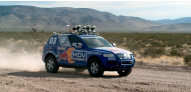

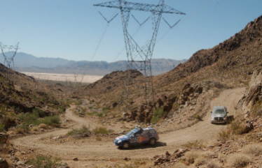

​	直到比赛前 2 小时，赛道信息对所有的参赛队伍是保密的。之后，每个队伍都会收到一张 CD-ROM，其中含有使用 DARPA 定义的数据格式存储的道路信息说明书 RDDF。RDDF 包含定义道路边界的经度，维度和宽度的列表以及相关速度限制的列表。下图就是其中的一个数据段。如果车辆大幅度的开出道路的边界，则会有被取消资格的风险。在 2005 年的比赛中，道路信息中含有 2935 个导航点。

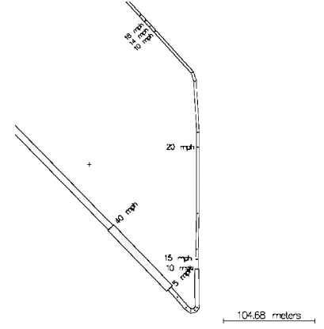

​	赛道的宽度与正常道路的宽度一致，在 2005 年的比赛中，一般在 3 到 30 米之间。限速是为了保护赛道上重要的基础设施和生态环境，也为了确保跟踪在每个自动驾驶车辆后面的 DARPA 司机的安全。车速限制在每小时 5 英里到 50 英里之间。RDDF 定义了自动驾驶车辆将采取的近似路径，所以不需要进行全局路径规划。因此，这场比赛主要是在沙漠地形中进行高速道路检测、障碍物检测和避障的测试。

​	所有的车辆都在同一赛道上比赛，每隔5分钟一个接一个地出发。当速度更快的车辆超过了速度较慢的车辆时，DARPA 工作人员会让速度较慢的车辆暂停，让第二个车辆像躲避静态障碍物一样超过第一个车辆。这就消除了车辆处理动态超车的需求。

### 团队成员

​	斯坦福赛车队是由四个主要小组组成的。车辆组负责监督与车辆核心相关的所有改装和部件开发。这包括线控驱动系统、传感器和计算机安装以及计算机系统。该小组由美国大众汽车电子研究实验室的研究人员主导；软件组开发所有的软件，包括导航软件和各种健康监测与安全系统。软件小组由斯坦福大学的研究人员主导；测试组负责根据指定的测试时间表，测试所有系统组件和整机系统。该组的成员与其他组的成员是分开的。测试小组由斯坦福大学的研究人员主导；宣传小组负责管理斯坦福赛车队的所有媒体关系和募款活动。该宣传小组由莫尔达维多风险投资公司的员工主导，其他所有赞助商也参与其中。团队的运营监督由一个包括所有主要支持者的指导委员会负责。

## 车辆

​	Stanley 是一辆基于柴油动力的大众途锐 R5 而改装的。途锐已经配备了四轮驱动，可变高度空气悬架和自动电子锁差速器。为了保护车辆免受伤害，Stanley 还配备了防滑板和加强前保险杠。除此之外，还有可以直接电子驱动油门和刹车的定制界面；附在转向柱上提供电子转向控制的直流电机；连接在变速杆上的线性制动器，用于切换车辆的前进挡，倒车档和泊车档，如下图；车辆数据，比如各个车轮的速度和转向角度，被自动感知并通过CAN 总线接口和计算机系统通信。

 The gear shifter, control screen, and manual override buttons.")

​	车辆定制的车顶行李架如下图所示，它装着 Stanley 几乎所有的传感器。车顶为车辆提供了最高的有利位置。从这一点上，地形的可见性是最好的并且访问全球定位系统 GPS 的信号阻塞最小。对于环境感知，车顶行李架装了 5 个德国 SICK 的激光测距仪。激光沿着车辆的行驶方向向前指向，但倾斜角度略有不同。激光测量在车辆前面 25 米的不同范围的近似地形的横截面。车顶行李架还装载一个彩色相机，用于远距离道路感知，它指向前方且角度略微偏下。对于远距离探测大的障碍物，Stanley 的车顶行李架还装有两个由 Smart Microwave Sensors 公司提供的 24 GHz 雷达传感器。每个雷达传感器可覆盖前方 200 米区域，方位覆盖角度约为 20°。该系统的两个天线安装在激光传感器阵列的两侧。激光传感器、彩色相机和雷达系统组成了系统的环境传感器组。也就是说，它们把前面的地形报告给 Stanley，这样 Stanley 就可以决定以什么速度往哪行驶。

 View of the vehicle's roof rack with sensors.")

​	再往后，车顶行李架上还有许多额外的天线：一个用于 Stanley 的 GPS 定位系统，两个用于 GPS 指南。GPS定位单元是一个 L1/L2/Omnistar HP 接收器。GPS 系统和车载惯性测量单元 IMU 共同组成定位传感器组，其主要功能是来估计车辆相对于外部坐标系统的位置和速度。

​	最后，一个无线电天线和三个额外的 GPS 天线来自 DARPA 的 E-Stop 系统也安装在车顶行李架上。E-Stop 系统是一种无线连接，可以让尾随 Stanley 的车辆在紧急情况下对 Stanley 安全迫停。车顶行李架上还装有一个信号喇叭、一个警示灯和两个手动 E-stop 按钮。

​	Stanley 的计算机系统位于汽车的后备箱，如下图。特殊的风管引导空气从车辆的空调系统进入后备箱进行冷却。后备箱的特点是装有一个耐用的机架，它携带六台奔腾M计算机阵列，一个千兆以太网交换机，以及各种与物理传感器和途锐制动器相连的设备。它还具有一个定制的电力系统和备用电池，以及一个开关盒，使 Stanley 能够通过软件对单个系统组件进行电力循环。DARPA 提供的 E-Stop 也位于这个机架上。后备箱还集成了大众途锐制动器的定制接口：刹车、油门、变速杆和转向控制器。一个六自由度的 IMU 被牢牢的固定在后备箱的计算机支架下面的框架上。

 The computing system in the trunk of the vehicle.")

​	新增设备的总功率需求约为 500 瓦，通过途锐的备用交流发电机提供。Stanley 的备用电池系统提供了一个额外的缓冲，以适应在沙漠高温下的长时间运转。

​	所有计算机上运行的操作系统都是 Linux。之所以选择 Linux，是因为它具有出色的网络和时间共享功能。在比赛期间，Stanley 在六台电脑中的三台上执行了比赛软件；第四台是用于记录比赛数据，还有两台电脑是闲置。三台运行比赛软件的电脑中的一台完全用于视频处理，而另外两台则执行所有其他软件。这些计算机能够以高达 100 Hz 的频率轮询传感器，并以高达 20 Hz 的频率控制转向、油门和刹车。

​	Stanley 的设计中一个重要的方面是遵守交通规则，所以驾驶员就可以像操作普通的轿车一样安全地操作自动驾驶车辆。Stanley 的定制用户界面使驾驶员可以随意使用和脱离计算机系统，即使是在车辆行驶的时候。因此，驾驶员可以在开发过程中的任何时候禁用计算机控制，重新获得对车辆的手动控制。为此，Stanley 配备了几个位于驾驶座附近的手动控制按钮。每一个开关控制着刹车，油门和转向这三大制动器之一。一个额外的中央紧急开关解除了所有计算机控制，使自动驾驶车辆变成了一辆传统的汽车。虽然这个特性跟实际比赛是没有相关性的，实际比赛中没有人会坐在车里，但这被证明在软件开发过程是大大有益的。这个界面可以让人在 Stanley 里自主操作，因为一个专业的驾驶员可以随时捕捉电脑故障，并承担完全的手动控制。

​	在真正的比赛中，车辆里当然没有驾驶员，所有的驾驶决定都是由 Stanley 的计算机系统做出的。Stanley 拥有一个操作控制界面，通过操控台上的触摸屏实现。该界面允许比赛工作人员在必要时关闭和重新启动车辆。

## 软件架构

### 设计原则

​	在 2004 年和 2005 年的超级挑战赛之前，DARPA 向参赛者透露，一辆四驱皮卡在理论上是能跑完全程的。这些公告表明，成功完成挑战所必需的创新将是设计智能驾驶软件，而不是设计稀奇古怪的汽车。这一声明和 2004 年比赛中顶尖选手的表现指导了斯坦福赛车队的设计理念：将自动导航视为一个软件问题。

​	基于之前在机器人架构的工作，Stanley 的软件架构采用著名的三层体系结构（Gat,1998），尽管没有一个长期的象征性的规划方法。在软件架构的设计中，许多指导原则被证明是必不可少的。

#### 控制和数据流程

​	在 Stanley 的软件系统中没有集中式的主进程。所有模块都以自己的节奏运行，没有进程间同步机制。相反，所有数据都带有全局时间戳，并且在集成多个数据源时使用时间戳。这种方法降低了死锁和不必要的处理延迟的风险。为了最大化系统的可配置性，几乎所有的进程间通信都是通过发布-订阅机制实现的。从传感器到执行器的信息以单一方向流动；同一模块接收的信息不会超过一次。在任意时间点，流程中的所有模块都同时运行，从而最大化信息吞吐量和最小化软件系统的延迟。

#### 状态管理

​	尽管软件是分布式的，系统的状态由各局部模块管理的。系统中有许多状态变量。健康状态由健康监视器本地管理；参数状态在参数服务器中管理；全局运行模式保持在有限状态自动机中；车辆状态由状态观测器模块进行评估。环境状态分解为多个映射（激光，相机和雷达）。每个映射都在专用模块中管理。因此，所有其他模块将接收相互一致的值。确切的状态变量将在本文后面的章节进行讨论。所有状态变量通过发布-订阅机制传播到软件系统的相关模块。

#### 可靠性

​	该软件强调自动系统的整体可靠性。有专门的模块用来监视各个软件和硬件组件的运行状况，并且在观察到故障时自动重启这些组件。通过这种方式，软件对特定的情况是健壮的。比如软件模块崩溃或者挂起或者传感器延迟等。

#### 开发支持

​	最后，软件系统是结构化的，以便于系统的开发和调试。开发人员可以简单的运行软件的一个子系统并轻松的跨不同的处理器迁移模块。为了便于开发过程中的调试，所有数据都被记录下来。通过使用专用的回放模块，软件可以在记录的数据上运行。开发了许多可视化工具，使得在车辆运行或回放以前记录的数据时检查数据和内部变量成为可能。开发过程使用了一个版本控制过程，该过程带有一套严格的竞赛质量软件发布规则。总的来说，我们发现软件在开发期间的灵活性对于实现长期自动驾驶所必需的高可靠性是至关重要的。

### 处理流程

​	比赛软件由大约 30 个模块并行运行，如下图。该系统分为六层，分别对应以下功能：传感器接口、感知、控制、车辆接口、用户界面和全局服务。

1.  **传感器接口层** 包括大量用于接收所有传感器数据并对其进行时间戳的软件模块。该层从每个激光传感器接收   75 Hz 的数据，从摄像头接收大约 12 Hz 的数据，从 GPS 和 GPS 指南接收 10 Hz 的数据，IMU 和途锐 CAN 总线接收 100 Hz 的数据。该层还包含一个数据库服务器用于处理赛道信息（RDDF文件）。
2.  **感知层** 将传感器数据映射到内部模块中。该层的主要模块是用于确定汽车的坐标，方向和速度的无损卡尔曼滤波 UKF（unscented Kalman filter）车辆状态评估器。基于激光、相机和雷达系统的三个不同的映射模块构建二维（2D）环境地图。寻路模块使用激光导出的地图来寻找道路的边界，因此车辆可以一直处于道路中央。最后，路面评估模块提取当前路面的参数，以确定安全车速。
3.  **控制层** 负责调整车辆的转向、油门和刹车。其中关键模块是路径规划器，它确定车辆在转向空间和速度空间的轨迹。该轨迹被传递给两个闭环轨迹跟踪控制器，一个用于转向控制，另一个用于刹车和油门控制。两个控制器都向执行器发送低级指令，执行器忠实地执行由规划器发出的轨迹。控制层还具有顶层控制模块，实现为一个简单的有限状态自动机。该模块可以响应通过车载触摸屏或无线 E-stop 接收到的用户命令确定车辆模式，并在需要倒车时维持挂挡状态。
4.  **车辆接口层** 作为自动驾驶车辆的线控系统的接口。它包含了车辆的刹车、油门和方向盘的所有接口。它还具有用于调节许多系统组件的物理功率的电源服务管理接口。
5.  **用户界面层** 包括远程 E-stop 和用于启动软件的触摸屏模块。
6.  **全局服务层** 为所有软件模块提供许多基本服务。命名和通信服务是由卡内基梅隆大学CMU（Carnegie Mellon University）提供的进程间通信工具包（Simmons & Apfelbaum,1998）实现的。中央参数服务器管理含有所有车辆参数的数据库，并以同步的方式更新数据。各个系统组件的电源功率是由电源服务器管理的。健康监测模块监视所有系统组件的运行状况，并在必要时重新启动特定的系统组件。时钟同步是通过时间服务器实现的。最后，数据日志服务器将传感器、控制和诊断数据转储到磁盘，以便回放和分析。

​	接下来的章节将更详细地描述 Stanley 的核心软件流程。文章最后将总结 Stanley 在超级挑战赛中的表现。

## 车辆状态评估

​	车辆状态评估是实现高精度驾驶的关键前提。不准确的姿态评估会导致车辆开出赛道，或者生成的地形图不能反映车辆的环境状态，导致糟糕的驾驶决策。在 Stanley 中，车辆状态总共包含 15 个变量。这些参数空间的设计遵循标准方法论（Farrell & Barth, 1999; van der Merwe & Wan, 2004），如下表所示。

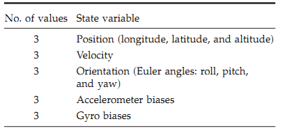

​	无损卡尔曼滤波器（UKF）（Julier & Uhlmann, 1997）以 100 Hz 的频率更新这些变量。UKF 整合了 GPS、 GPS 指南、 IMU 和车轮速度传感器的观测结果。GPS 系统提供绝对位置和速度测量，这两者都纳入 UKF 。从数学的角度来看，σ 点线性化的 UKF 产生的估计误差往往低于线性化的基于扩展卡尔曼滤波的泰勒展开式 EKF（van der Merwe, 2004）。对大多数情况，从实现的立场看 UKF 也是更加可取的，因为它不需要任何函数行列式矩阵的显式计算，尽管这些对进一步分析是有用的。

​	当 GPS 可用时，UKF 只使用了 “Weak” 模式。这个模型符合一个移动中的物体可以向任何方向移动的定理。因此，在正常工作模式下，UKF 对相对于车辆方向的速度矢量方向不施加约束。这样的模型显然是不准确的，但是在光滑的沙漠地形中，车辆与地面的相互作用通常很难建模。移动物体模型允许可能发生在越野驾驶中的任何打滑或侧滑。

​	然而，该模型在 GPS 中断时表现不佳，因为车辆的位置强烈依赖 IMU 传感器的精度。因此，在 GPS 中断期间使用了更严格的 UKF 运动模型。该模型约束车辆只沿其指向的方向运动。集成 IMU 的陀螺仪的方向和车轮的速度计算位置，能够在 GPS 中断的 2 分钟内保持准确的姿态评估。累积误差通常以厘米为单位。Stanley 的健康监测器将降低 GPS 故障期间的最大车速至每小时 10 英里，以最大限度地提高受限制车辆模型的准确性。在 GPS 中断使用 Weak 车辆模型的位置评估结果如下图 a，而图 b 使用的强车辆模型的评估结果。这个实验说明了该滤波器在 GPS 中断时的表现。显然，GPS 故障期间精确的车辆建模是至关重要的。在一条铺好的道路上进行的实验中，我们发现即使在没有 GPS 的情况下循环行驶 1.3 公里，车辆累积误差也只有 1.7 米。

 Without integrating the wheel motion the result is highly erroneous. (b) The wheel motion clearly improves the result.")

  

## 激光地形测绘

  

### 地形标记

  

​	为了安全地避开障碍物，Stanley 必须能够在足够的范围内准确地探测到不可行驶的地形，以便停车或采取适当的规避动作。车辆移动得越快，就必须检测到越远的障碍物。激光被用作 Stanley 短距离和中距离避障的基础。Stanley 车顶装有 5 台单扫描激光测距仪，倾斜向下扫描前方道路。扫描过程如下图 a。每个激光扫描产生一个大小为 181 位的向量，间隔 0.5 度。将这些扫描投影到全局坐标系中，根据车辆估计的姿态，得到每个激光的三维点云。图 b 则显示了多个不同的传感器所获取的三维点云的例子。这种 3D 点的坐标表示如下，其中 k 是被捕获点的时间索引，而 i 是激光束的索引。

$$
(X_k^i\ Y_k^i\ Z_k^i)
$$
 Illustration of a laser sensor: The sensor is angled downward to scan the terrain in front of the vehicle as it moves. Stanley possesses five such sensors, mounted at five different angles. (b) Each laser acquires a three-dimensional (3D) point cloud over time. The point cloud is analyzed for drivable terrain and potential obstacles.")

​	激光点云上的障碍物检测可以视为一个分类问题，在一个网格表面中为每个二维位置分配三个可能的值：已占用、自由和未知。如果我们可以找到两个邻近点的垂直距离超过关键的垂直距离阈值（如下公式），可以认为该位置是一个障碍。如果没有发现这样的点，则可以认为是可以正常通行的（没有障碍），但至少有一个读数分到相应的网格单元。如果没有读数分配给网格单元，则认为该网格单元的可驾驶性是未知的。对附近点的搜索被方便地安排在一个 2D 网格中，与提供给车辆导航系统的最终可行驶地图使用的网格相同。下图就是网格单元的例子，如图所示，地图将地形分为三类：可驾驶、已占用或未知。
$$
两点之间的垂直距离：|Z_k^i - Z_m^j| \ \ \ \ \ \ \ \ \ \ \ \ \ \ \ \   垂直距离阈值：\delta
$$
 An underpass and (b) a road.")

​	遗憾的是，将这种分类方案直接应用于激光数据会产生不适合可靠的自动导航的结果。下图就是个例子，车辆横滚角/俯仰角评估中的小错误会导致大量的地形分类错误，从而导致车辆开出道路。由于激光只针对车辆前方 30 米以内的道路，微小的姿态误差在激光点的映射位置上被放大成较大的误差。在标签地形的参考数据集中，我们发现，在垂直距离阈值为 15 厘米时，有 12.6% 的可行驶区域被划分为障碍。即使横滚角/俯仰角误差小于 0.5，这种情况也会发生。这种量级的姿态错误可以通过用几十万美元的姿态评估系统解决，但是这样的选择对于这个项目来说太昂贵了。

 induce massive terrain classification errors, which if ignored could force the robot off the road. These images show two consecutive snapshots of a map that forces Stanley off the road. Here, obstacles are plotted in red, free space in white, and unknown territory in gray. The blue lines mark the corridor as defined by the RDDF.")

​	解决这个问题的关键如下图。这张图的沿着纵轴标出从平坦地形收集的感知障碍的高度阈值。
$$
|Z_k^i-Z_m^j|
$$
显然，对于一些网格单元，感知障碍的高度阈值是较大的 -- 尽管事实上地面是平的。然而，这个函数不是随机的。横轴上描述了获取这些扫描的时间差。很明显，评估错误与两次扫描之间的时间差密切相关。
$$
\bigtriangleup t|k-m|
$$
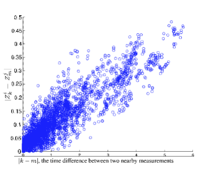

​	为了模拟这种误差，Stanley 使用  first-order Markov 模型，该模型模拟了姿态评估出错一段时间内的漂移。因此，对障碍是否存在的测试是一种概率性测试。假设给两个点，那么它们的高度差会在与时间差 |k-m| 成正比的直线附近呈正态分布的。因此，Stanley 为障碍的存在使用概率性的测试，其中 a 是置信度阈值，比如 a = 0.05。
$$
p(|Z_k^i-Z_m^j|>\delta)>\alpha
$$
​	当应用于 2D 网格数据时，概率性的方法可以有效的实现，因此每个网格只需要存储两个测量值。这是因为每个测量都为将来的障碍物检测的 Z 值定义了一个界限。例如，假设我们观察到之前观察到的网格的测量值。那么，三种情况中有一种或几种情况是正确的:

1. 根据概率论测试，测量值有可能被视为是判别障碍物的依据。在这种情况下，Stanley 简单地将网格视为障碍，不在进行下一步的测试；
2. 测量值不被视为判别障碍物的依据。但在之后的测试中，将会设定比之前存储的测量量更加严格的最小值 Z 的下界。在这种情况下，我们的算法会用这个值替换之前的。这背后的原理很简单：如果测量值比之前的更加有限制性，那么针对此点的测试如果不失败的话， 那么针对之前点的测试也会成功的。因此，旧的点可以安全的废弃；
3. 第三种情况与第二种情况相同，但对上值进行了改进。测量可以同时细化下界和上界。

   

​	每个网格单元只需要存储两次测量值，这使得该算法在空间和时间上都非常高效。

  

### 数据驱动的参数调优

  

​	开发这个制图算法的最后一步是参数调优。我们的方法和潜在的概率马尔可夫模型掌控许多未知的参数。这些参数包括垂直距离阈值，置信度阈值 a，和各种各样的马尔可夫链误差参数（过程噪声和测量噪声的协方差）。

​	Stanley 使用判别式学习算法局部优化这些参数。该算法以最大限度地提高标记训练数据上的地形分析结果的识别精度来调整参数。

​	这些数据通过驾驶员进行标记，与波默洛（1993）的想法相似。下图演示了这种方法：指示驾驶员只在无障碍的地形上行驶。然后，车辆所穿过的网格单元被标记为可驾驶区域，该区域对应于下图中的蓝色条纹；道路左侧和右侧的条纹则都被视为障碍，下图的红色条纹；可驾驶区域和障碍物之间的距离是根据这段道路的平均宽度人为设定的。显然，并不是所有标记为障碍物的网格区域实际上都被障碍物占据；然而，即使是针对近似标记的训练也足以提高制图器的整体性能。

 and two stripes at a fixed distance to the left and the right are labeled as obstacles(red) . While these labels are only approximate, they are extremely easy to obtain and significantly improve the accuracy of the resulting map when used for parameter tuning.")

​	学习算法现在通过坐标上升算法实现。在外部循环中，算法执行相对于数据驱动的评分函数的坐标上升。在给定初始猜测的情况下，坐标上升算法依次对参数进行一定数量的修改。然后，在对日志数据集进行评估时，确定新值是否比前一个值有改进，并相应地保留它。如果对于一个给定的间隔大小不再提高，则减半搜索区间并继续搜索，直到搜索区间变得小于预设的最小间隔，此时调优终止。

​	概率论分析与判别式学习算法结合进行参数调整，对提高地形标记的准确度有显著效果。使用一个独立的测试数据集，我们发现假阳性率（上图中标记为可行驶的区域）从 12.6% 下降到 0.002%。与此同时，道路旁边被标记为障碍物的比率基本保持不变的（从 22.6% 到 22.0%）。这比率并不是 100%，原因很简单，那里的大部分地形还是平坦的，可驾驶的。我们的数据采集方法错误地将平坦的地形标记为不可驾驶。然而，这种误标记并不妨碍参数调优算法，因此优于手动标记像素的繁琐过程。

​	下图中显示了运行中的测绘仪的样子。从车辆的侧拍可以看出，由于俯仰角的变化，路面有一部分被扫描了多次。因此，没有使用概率论方法会产生在路中间有大量的被占用的区域的幻觉，如下图c；我们的概率论方法克服了这个错误，并生成了一个可以驾驶的地图，如下面的第二张图 c。

 The reading of the center beam of one of the lasers, integrated over time (some of the terrain is scanned twice.) ; (b) shows 3D point cloud; (c) resulting map without probabilistic analysis, and (d) map with probabilistic analysis. The map shown in (c) possesses a phantom obstacle, large enough to force the vehicle off the road.")

  

## 机器视觉地形分析

  

​	激光测绘仪探测障碍物的有效最大距离约为 22 米。这一范围足以使 Stanley 在 25 mph 的时速下可靠地避障。基于 2004 年的赛道，开发团队估计 Stanley 需要达到每小时 35 英里的速度才能成功完成挑战。为了扩大传感器的范围以保证在 35 英里每小时的安全行驶，Stanley 使用彩色摄像机在超出激光分析范围的情况下寻找可行驶的路面。下图是激光传感器和相机的对比。左边的图显示的是在比赛中获得的激光地图，在这里能检测到大约 22 米范围内的障碍物。而视觉图则如右边的图所示，其障碍物检测的范围延伸超过 70 米（每个黄圈对应 10 米的范围）。

 and the image-based (right) mapper. For scale, circles are spaced around the vehicle at a 10 m distance. This diagram illustrates that the reach of lasers is approximately 22 m, whereas the vision module often looks 70 m ahead.")

​	我们的工作建立在长期的寻路研究的基础上（Pomerleau, 1991; Crisman & Thorpe,1993）,参见（Dickmanns 2002）。为了寻找道路，视觉模块将图像分为可行驶区域和不可行驶区域。这种分类任务通常比较困难，因为道路的外观受到许多不容易测量和随时间变化的因素的影响，比如道路的表面材料、光照条件、相机镜头上的灰尘等等。这表明一种自适应的方法是必要的，在这种方法中，图像解释随着车辆移动和条件的变化而变化。

​	对于视觉绘图器来说，相机图像并不是前方地形信息的唯一来源。我们已经从激光测绘仪中获取了近距离的可驾驶信息，但是我们还是对于利用视觉对激光范围之外的地形进行分类，以扩大激光分析的范围。这不同于一般用途的图像判别问题，在一般用途的图像判别问题中没有这类数据。

​	Stanley 通过将激光分析的可行驶区域投射到相机图像中，找到可行驶的表面。更具体地说，Stanley 在激光地图中提取出车辆前方的一个四边形，这样这个四边形中的所有网格区域都可以驾驶。这个四边形的范围通常在车辆前方 10 到 20 米之间。这样的一个四边形如上图 a 所示。使用简单的几何投影，然后映射这个四边形到摄像机图像，如下图 b 所示。然后采用自适应计算机视觉算法将四边形内的图像像素作为可驾驶表面的训练样本。

 a raw image; (b) the processed image with the laser quadrilateral and a pixel classification; (c) the pixel classification before thresholding; and (d) horizon detection for sky removal.")

​	学习算法维护一个对可行驶地形的颜色建模的高斯混合模型。每个这样的混合点是单个像素在红/绿/蓝（RGB）空间中定义的高斯分布。高斯点的总数表示为 n。对于每个混合点，学习算法保持一个 RGB 颜色平均值ui，协方差和，用于训练这个高斯模型的像素点的总数m。

​	当观察到一张新的图像时，使用 EM（Duda & Hart,1973）算法将可行驶四边形中的像素点映射成 k 个局部高斯点，k < n（这些局部高斯点的协方差被一些较小的数值夸大，以避免过拟合）。这些 k 个局部高斯点被合并到学习算法的内存中，以一种允许快慢自适应的方式。学习自适应图像有两种可能的方式：通过调整之前发现的内部高斯到实际图像像素；以及通过引入新的高斯和丢弃旧的高斯。这两项适应措施都是必不可少的。第一种使Stanley 能够适应缓慢变化的光照条件；第二种，使它能够迅速适应新的表面颜色，比如 Stanley 从铺砌的路上往未铺砌的路上走的时候。

​	具体来说，为了更新内存，考虑第 j 个局部高斯函数。学习算法通过马氏距离来确定全局内存中最接近的高斯分布。
$$
d(i,j)=(u_i-u_j)^T({\sum}_i+{\sum}_j)^{-1}(u_i-u_j)
$$
​	设 i 是内存中最小高斯函数的索引。学习算法然后从两种可能的结果中选择一种:

1. 马氏距离小于等于可接受阈值。然后，学习算法假设全局高斯 j 代表局部高斯 i，自适应进展减缓。将全局高斯函数的参数设为加权平均值：
    $$
    u_i\leftarrow {m_iu_i\over m_i+m_j}+{m_ju_j\over m_i+m_j},
    $$

    $$
    {\sum}_i \leftarrow {m_i\sum_i \over m_i+m_j}+{m_j\sum_j\over m_i+m_j}
    $$

    $$
    m_i \leftarrow m_i+m_j
    $$

    其中，mj 为图像中对应第 j 个高斯分布的像素点个数。

2. 内存中的任意一个高斯点的马氏距离小于可接受阈值。在这种情况下，内存中的高斯函数都不接近从图像中提取的局部高斯函数，其接近度由马氏距离来测量。然后这个算法会在全局内存中生成一个新的高斯参数。如果所有的 n 槽都存入内存中，那么算法就会遗弃有最小总像素个数的高斯分布，并用最新的局部高斯分布代替他。

  

​	这步之后，内存中的每个计数 mi 都被清算因为 r < 1 的因素。这个指数衰减项确保了随着可行驶路面的外观随时间变化，内存中的高斯函数可以向新的方向移动。

​	为了找到可行驶的路面，学习高斯函数被用于分析图像。图像分析使用Ettinger，Nechyba，Ifju & Waszak（2003）中定义的天空移除初始化的步骤。随后会删除额外的没有被算法找到的顶点像素。对剩余的像素采用学习后的混合高斯模型并以直接的方式进行分类。RGB 值接近一个或多个学习高斯函数的像素被归为可行驶的像素；所有其他像素标记为不可驾驶。最后，只有连接到激光四边形的区域被标记为可行驶的。

​	上图中演示了关键的处理步骤。图 a 中展示的是一张相机 raw 格式的图像，而图 b 是处理后的图像。可行驶像素用红色表示，不可行驶像素用蓝色表示。剩余的两张图都是中间的处理步骤：设置阈值之前的像素分类，如图c；天际线查找结果，如图 d。

​	由于能够在运行中创建新的高斯探测器，Stanley 的视觉程序可以在几秒钟内适应新的地形。下图显示的是从 DARPA 超级挑战赛的全国资格赛 NQE（National Qualification Event）中获取的数据。在这里，车辆从铺砌好的路面移动到草地上，两者都是可以行驶的。下图的序列说明了适应性的作用：图像底部的框区是训练区域，图像中的红色是应用学习分类器后的结果。从下图中可以很容易地看出，视觉模块在 1 秒内成功地适应了从路面到草地的变化，同时仍然正确地标记了干草包和其他障碍物。

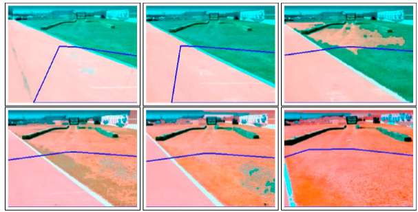

​	在缓慢变化的光照条件下，系统对路面的适应更缓慢，在分类中广泛使用过去的图像。下图的第二行显示了这一点，它显示了在啤酒瓶通道（2005 年比赛中最困难的赛道）获得的一系列图像的结果。在这里，大部分地形具有相似的视觉外观。然而，视觉模块仍然能够很好地划分道路。这样的结果，只有一种可能是因为系统平衡使用过去的图片和适应新的相机图像的能力。

​	一旦相机图像被分类，它就会被映射成一个俯视图，类似于激光产生的 2D 图，如图 14 中的 b 图。由于即使在平坦的地形上也会有颜色的变化，所以视觉地图不用于转向控制。相反，它专门用于速度控制。当探测到 40 米范围内没有可行驶的道路时，自动驾驶车辆就会减速到每小时 25 英里，以此来为激光导航提供有效的安全距离。换句话说，视觉分析对于超出激光传感器范围的障碍物起到了预警系统的作用。

​	在开发视觉分析的活动时，研究小组研究了许多不同的学习算法。高斯混合模型的主要替代方法之一是判别方法，它使用 boosting 和决策树进行分类（Davies & Lienhart, 2006）。该方法依赖于不可行驶地形的实例，使用类似于寻找可行驶四边形的算法来提取。一项使用 2004 年赛道上收集的独立测试数据进行的性能评估导出了不确定的结果。下表中显示了两种方法的分类精度；用于平坦的沙漠道路和山路。最终选择生成高斯混合模型的方法，因为它不需要不可驾驶的地形的训练样本，这在平坦的路上是很难获得的。

  

## 道路属性评估

  

### 道路边界

  

​	避开障碍物的一种方法是探测它们并绕过它们。这是激光测绘仪的主要功能。另一种有效的方法是开车时尽量选择障碍较少的道路。这是合理的，因为世界上的障碍很少是均匀分布的。在沙漠道路上，障碍物—比如岩石、灌木和栅栏—通常存在于道路两旁。通过简单地在道路中间行驶，沙漠道路上的大多数障碍都可以避免，甚至不需要检测它们。

​	因此，保持在道路中轴附近的方法是 Stanley 的导航系统中最有效的组件之一。为了找到道路中心，Stanley 基于激光测绘图使用概率低通滤波器确定道路两边。这个想法很简单；在预期中，道路两边与 RDDF 数据平行。然而，道路边界到 RDDF 中心的确切横向偏移量是未知的，并且会随时间变化。Stanley 的低通滤波器是用一维卡尔曼滤波器 （KFs）实现的。每个滤波器的状态为道路两边到 RDDF 中心的横向距离。KFs 沿着正交于 RDDF 的中轴方向离散搜索可能存在的障碍物，如下图 a 所示。最大的自由偏移量就是 KF 要观测的内容，因为它建立了道路边界的局部易用性。因此，如果 Stanley 的视野中有多条平行的道路，被一条小护堤隔开，那么过滤器将只追踪最内侧的可驾驶区域。

 Search regions for the road detection module: The occurrence of obstacles is determined along a sequence of lines parallel to the RDDF; and (b) the result of the road estimator is shown in blue, behind the vehicle. Notice that the road is bounded by two small berms")

​	利用 KF 的整合的功效，道路边界变化减缓。因此，小障碍，或短暂没有侧面的障碍的情况，对道路边界估计的影响最小化；然而，长期存在的障碍确实会产生强烈的影响。

​	根据这些过滤器的输出，Stanley 将道路定义为两个边界的中心。道路中心的侧向偏移是路径规划过程中轨迹得分的一个组成部分，将在下面进一步讨论。在没有其他意外情况的情况下，Stanley 慢慢地向评估的道路中心靠拢。根据经验，我们发现这种驾驶技术可以避开沙漠道路上的绝大多数天然障碍物。虽然道路中心显然只是一个探索方式，但我们发现它在广泛的沙漠试验中是非常有效的。

​	上图 b 中显示的是道路的估计结果。那里的蓝色道路是 Stanley 对这条路的最佳评估。请注意，道路被两个小护坡堤所限制，它们都被激光测绘仪检测到。这个模块在 Stanley 穿越沙漠道路的能力中扮演了重要的角色。

###   

### 地形崎岖

  

​	除了避开障碍物和沿着道路保持居中，安全驾驶的另一个重要组成部分是选择一个合适的速度（Iagnemma & Dubowsky, 2004）。直观地说，沙漠地形从平坦且光滑到陡峭且崎岖都有。地形类型对确定车辆的最大安全速度起着重要作用。在陡峭的地形上，开车太快可能会导致摆尾或滑行。在崎岖的地形上，过快的速度可能会导致极端的冲击，从而损坏或摧毁车辆。因此，感知地形类型对车辆的安全至关重要。为了解决这两种情况，Stanley 的速度控制器不断估计地形坡度和崎岖程度，并使用这些值来设置合理的最大速度。

​	地形坡度是直接从车辆的俯仰角评估的，计算由 UKF 执行（从 Brooks & Iagnemma 借用 2005）。地形崎岖程度使用车辆的垂直加速度传感器测量。对垂直加速度进行了带通滤波，消除了重力和车辆振动的影响，使振动保持在车辆的谐振频率范围内。产生的信号的振幅是测量车辆由于地形的刺激所经历的垂直冲击。根据经验，过滤后的加速度似乎随速度线性变化，如下图。换句话说，将车辆在一段地形上的最大速度提高一倍，将使车辆的最大加速度差增加一倍。在 9.1 节中，这个关系将被用来推导一个简单的规则来设置最大速度，以近似地限制在车辆上的最大冲击。

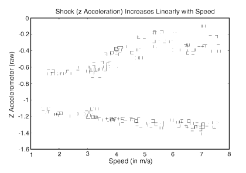

  

## 路径规划

  

​	如前所述，DARPA 提供的 RDDF 文件在很大程度上消除了任何全局路径规划的需求。因此，Stanley 的路径规划器的角色主要是局部避障。Stanley 的路径规划器不是在全局坐标系中规划的，而是在一个独特的坐标系中制定的：正交距离，或固定基础轨迹的 “侧向偏移”。改变侧向偏移量使 Stanley 相对于基本轨迹左右移动，就像汽车在高速公路上改变车道一样。通过智能地改变侧向偏移，Stanley 可以在赛道上快速前进的同时避开障碍。

​	定义侧向偏移量的基本轨迹只是 RDDF 赛道骨架的一个平滑版本。重要的是要注意到这个基本轨迹并不意味着在任何意义上都是最优轨迹；它作为基线坐标系，在此基础上，避障机制被不断地分层。下面两个部分将介绍Stanley 的路径规划软件的两个部分：在比赛前生成基本轨迹的路径平滑器和不断调整 Stanley 轨迹的在线路径规划器。

  

### 路线平滑

  

​	任何路径都可以作为在侧向偏移空间所规划的基本轨迹。然而，基本轨迹的某些性质将改善整体性能。

- **平滑度**。RDDF 是对赛道的粗略描述，包含许多急转弯。盲目地遵循 RDDF 路径点会导致明显的超调和过高的侧向加速度，这两种情况都会对车辆安全造成不利影响。使用比原始 RDDF 更平滑的基本轨迹将使 Stanley 在转弯时速度更快，并能以更高的准确度跟随预定轨迹。

- **匹配的曲率**。尽管 RDDF 的信息在预期中与赛道平行，但由于路径点的数量有限，RDDF 文件对道路的曲率预测得很差。默认情况下，Stanley 会倾向于平行于基本轨迹行驶，因此选择一个曲率更好地匹配下面的沙漠道路曲率的轨迹会导致更少的侧向偏移变化。这也将造就更平稳、更快的行驶体验。

   

​       Stanley 的基本轨迹是在赛前通过四级程序计算出来的。

1. 首先，点按局部曲率的比率添加到 RDDF 中，如下图 a；

2. 然后通过最小二乘优化调整上采样轨迹中所有点的坐标。直观地说，该优化调整了每个路径点，使路径的曲率最小化，同时尽可能接近原始 RDDF 中的路径点。最终的轨迹仍然是分段线性的，但是它比原来的 RDDF 平滑得多。假设 x1, x2 ... xn 为待优化的基本轨迹的路径点。对于这些的每一个点，我们在原始 RDDF 上给定一个对应点，记为 yi。点 x1, x2 ... xn 通过最小化以下加性函数得到。
    $$
    argmin_(x_1,...x_n)\sum_i|y_i-x_i|^2 \\
    -\beta\sum_n{(x_{n+1}-x_n)(x_n-x_{n-1})\over|x_{n+1}-x_n||x_n-x_{n-1}|}\\
    +\sum_nf_{RDDF}(x_n)
    $$
    其中，|yi - xi|2 是点 xi 和对应的 RDDF 中的锚点 yi 的二次方距离，且 i 是点 xi 在点集上的索引。为了确保基本轨迹尽可能贴近原始的 RDDF，需要最小化该距离；公式的第二个表达项是曲率，它通过最小化线段向量的点积来最小化基本轨迹中两个连续线段之间的夹角。它的作用是平滑轨迹：角度越小，轨迹越平滑。标量 beta 抵消了这两个目标，是 Stanley 软件中的一个参数；最后一项是可微分的界限函数，当点靠近 RDDF 边界的时候，该值会往无限大靠近，但是在远离边界的赛道内时则接近为 0。因此，平滑的轨迹总是在有效的 RDDF 赛道内。使用共轭梯度下降的快速版本执行优化，该优化在二维空间自由移动 RDDF 点。

3. 下一步的路径平滑涉及到三次样条插值。这一步的目的是得到一条可微的路径。这条路径可以被有效地重新采样。

4. 路径平滑的最后一步是计算光滑轨迹各路径点的限速。限速是以下三个量的最低值：（1）原始 RDDF 中相应路段的限速；（2）因为侧向加速度而设置的限速；（3）来自有界减速约束的限速；侧向加速度约束迫使车辆在转弯时适当减速。在计算这些极限时，我们将车辆的侧向加速度限制在 0.75 m/s2，以使车辆在弯曲路段有足够的操作能力安全地避开障碍物。有界限的减速约束迫使车辆减速在预期的转弯和变化在 DARPA 的速度限制。

     

​	下图演示了平滑处理一小段 RDDF 数据的效果。图 a 显示了平滑之前的 RDDF 以及基于轨迹的上采样。图 b 和图 c 显示了平滑之后的轨迹，用红色标记。整个数据预处理步骤是完全自动化的，对于整个 2005 年的赛道，在一台 1.4 GHz 的笔记本电脑上只需要大约 20 秒的计算时间。这个基本轨迹被转移到 Stanley 上，软件也准备好了。没有其它的关于环境或比赛的信息需要提供给 Stanley 了。

 Adding additional points; (b) the trajectory after smoothing (shown in red) ; (c) a smoothed trajectory with a more aggressive smoothing parameter. The smoothing process takes only 20 seconds for the entire 2005 course.")

​	值得注意的是，Stanley 没有修改原始 RDDF 文件。基本轨迹仅作为避障坐标系。当评估特定轨迹是否在指定赛道内时，Stanley 会检查原始 RDDF 文件。这样，预处理步骤不会影响对赛道中比赛规则的限制的解读。

  

### 在线路径规划

  

​	Stanley 的在线规划和控制系统类似于 Kelly & Stentz（1998）的理论。路径规划器的在线组件负责确定比赛中车辆的实际轨迹。路径规划器的目标是在成功地避开障碍物并保持在 RDDF 赛道的同时，尽可能快地完成比赛。在没有障碍的情况下，路径规划器将保持一个恒定的侧向偏移的基本轨迹。这将导致在一条与基本轨迹平行的路径上行驶，但可能会向左或向右移动。如果遇到障碍，Stanley 会规划一个平滑的侧向偏移路径，以避免障碍，并可以安全地执行。在侧向偏移空间进行规划还有一个优点，就是可以很好地处理 GPS 误差。GPS 误差可能会系统性地改变 Stanley 的位置评估。路径规划器将简单地调整当前轨迹的侧向偏移，使车辆重新进入道路中央。

​	路径规划器被实现为一个搜索算法，在一个固定的车辆模型下，用于最小化连续成本函数的线性组合。车辆模型包括几个运动学和动力学约束，包括最大侧向加速度（防止甩尾）和最大转向角（联合限制），最大转向速率（转向电机的最大速度）和最快减速。成本函数会惩罚越过障碍物、离开 RDDF 赛道、以及当前轨迹到路面感知中心的侧向偏移。软件约束引出一个可采纳轨迹的排序，Stanley 从中选择最佳轨迹。在计算总路径代价时，未知区域被视为可行驶的路面，这样车辆在道路上遇到未映射的点或镜面表面（如水坑）时就不会转弯。

​	在每一个时间步长，路径规划器重新考虑从一个 2D 空间绘制的轨迹。第一个方面描述添加到当前轨迹的横向偏移量。这个参数允许 Stanley 左右移动，同时仍然基本保持与基本轨迹平行。第二个方面描述了 Stanley 将尝试改变到这个侧向偏移的速率。前视距离与速度有关，范围为 15 - 25 米。所有候选路径都在车辆模型中运行，以确保符合车辆的运动学和动力学约束。在基本轨迹之上重复分层这些简单的动作可以产生相当复杂的轨迹。

​	路径搜索中的第二个参数允许路径规划器控制避障的迫切性。道路上的离散的障碍物，如岩石或篱笆桩，通常需要尽可能快地改变侧向偏移。在不违反侧向加速度约束的情况下，能够快速改变侧向偏移量的路径称为转向。道路边界位置的缓慢变化需要缓慢平稳地调整侧向偏移量。在给定的规划平面上，具有最慢的侧向偏移变化的轨迹称为微移。快速变化用于避开迎面的障碍物，缓慢变化用于平稳跟踪道路中心。下图显示了转向和微移。在直线道路上，由此产生的轨迹类似于 Ko & Simmons’s （1998）的车道卷曲率方法。

Paths that change lateral offsets with the minimum possible lateral acceleration (for a fixed plan horizon); and (b) the same for the maximum lateral acceleration. The former are called nudges, and the latter are called swerves.")

​	路径规划器以 10 Hz 的频率执行。路径规划器对于车辆实际和设计的路径的偏差是不知道的，因为这些是由低水平的转向控制器处理的。因此得到的轨迹总是连续的。在不违反最大侧向加速度约束的情况下，可以急转和刹车。

​	下图显示了路径规划器的一个示例。这里展示的是来自啤酒瓶通道的情况，这是 2005 年超级挑战赛中最困难的通道。这幅图只说明了两个搜索参数中的一个：侧向偏移量。它说明了通过逐渐改变相对于基本轨迹的侧向偏移而产生轨迹的过程。通过使用基本轨迹作为参考，路径规划可以在低维空间中进行，我们发现这对于实时性是必要的。

. Stanley is traveling 31.4 mph; and hence, can only slowly change lateral offsets due to the lateral acceleration constraint. The second example is taken from the most difficult part of the 2005 DARPA Grand Challenge, a mountainous area called Beer Bottle Pass. Both images show only nudges for clarity.")

  

## 实时控制

  

​	一旦路径规划器确定了车辆的预期路径，就必须计算实现该路径所需的适当的油门、刹车和转向命令。这个控制问题将被描述为两部分：速度控制器和转向控制器。

  

### 速度控制

  

​	多个软件模块输入了 Stanley 的速度，最明显的是路径规划器、健康检测器、速度推荐器和低等级速度控制器。低等级速度控制器将从前三个模块的速度命令转换为实际的油门和刹车命令。执行的速度总是三个推荐速度中的最小值。路径规划器将根据基本轨迹速度限制和任何转向制动来设置车辆速度。在某些预先设定的情况下，如 GPS 断开或关键系统故障，车辆健康监测器将降低最大速度。

​	速度推荐器根据评估的地形坡度和崎岖程度设置一个合适的最大速度。当车辆俯仰角超过 5° 时，地形坡度会影响最大速度。当坡度超过 5° 时，车辆的最大速度将线性降低，在极限情况下，车辆的速度限制到 5 英里/小时。地形崎岖程度被反馈到一个具有滞后的控制器，该控制器利用过滤的垂直加速度振幅和速度之间的线性关系控制最大速度的设定值。如第 7.2 节所述，如果崎岖的地形引起的振动超过了允许的最大阈值，最大速度会被线性降低，因此继续遇到类似的地形就会产生恰好满足冲击极限的振动。除非任何进一步的冲击，最大速度限制随着驾驶距离缓慢线性增加。

​	这个规则可能看起来很奇怪，但它有很大的实际意义；当车辆遇到车辙，该规则降低了 Stanley 的速度。显然，减速发生在遇到车辙之后，而不是之前。通过缓慢恢复速度，Stanley 将以更低的速度接近附近的车辙。因此，Stanley 倾向于在有很多车辙的地方开得很慢，只有在一段时间没有车辙的情况下才会回到基本轨道速度。虽然这种方法不能避免孤立的车辙，但我们发现它在避免许多可能伤害车辆的冲击方面非常有效。在波浪状的地形上行驶和在车辙上行驶一样困难。在崎岖不平的地形上，减速可以通过减少共振的影响，降低磕碰的频率。

​	速度推荐系统有两个特征参数：最大允许冲击和线性回归率。两者都是从人为驾驶中学来的。更具体地说，通过记录驾驶员在崎岖地形的速度曲线，Stanley 确定了最接近人类驾驶速度曲线的参数。下图显示了驾驶员在2004 年超级挑战赛的”达格特山脊“路段上的行驶速度曲线。它还显示了 Stanley 的控制器针对同一数据集的速度配置曲线。这两个配置曲线在相同的区域往往会同时变慢。然而，Stanley 的曲线在两个方面是不同的：自动驾驶车辆的减速比人快得多，并且它的速度恢复是线性的，而人的速度恢复是非线性的。加速度的限制是为了保护车辆免受进一步的冲击。

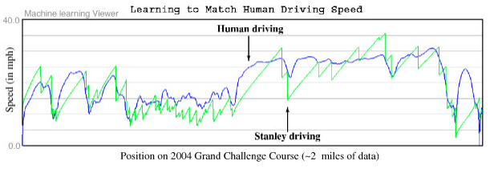

​	一旦路径规划器，速度推进器和健康监测器已经提交所有速度，这些速度中的最小值通过速度控制器来实现。速度控制器把刹车和油门视为两个相反的单作用力，用于对汽车施加纵向力。这是一个非常接近的刹车系统和简化的油门系统。控制器计算一个单一的误差度量，等于速度误差的加权和和速度误差的积分。相对权重决定了干扰抑制和超调之间的权衡。当误差度量为正时，制动系统命令制动缸压力与 PI 误差度量成正比；当它是负的，油门标准是设定成 PI 误差度量成反比。通过对两个执行器使用相同的 PI 误差度量，系统能够避免与相反的单作用执行器相关的颤振和死带。为了实现所要求的制动压力，滞后制动执行器通过对途锐测量的制动压力的饱和比例反馈进行控制，并通过 CAN 总线接口进行报告。

  

### 转向控制

​	转向控制器接受由路径规划器生成的轨迹，UKF 姿态和速度评估，以及测量的方向盘角度作为输入。它以 20 Hz 的频率输出转向命令。该控制器的功能是在快速变化的地形中，闭环跟踪由路径规划器决定的行驶路径。

​	关键的误差标准是轨迹误差 x(t)，如下图所示，就是测量车辆前轮中心点到轨迹的最近的点的侧向距离。现在的目的是命令转向控制收敛 x(t) 于零。Stanley 的转向控制器的核心是一个基于轨迹误差的非线性反馈函数，该函数可以证明为指数收敛。车辆在 t 时的速度记为 u(t)，在没有错误的情况下，使用这个公式，Stanley 的前轮会和全局轨迹的方向匹配。如下图，Psi 角度描述了最近路径段的方向和车辆自身的方向的角度。在没有任何横向误差的情况下，转向控制律会让前轮平行于规划路径的方向。

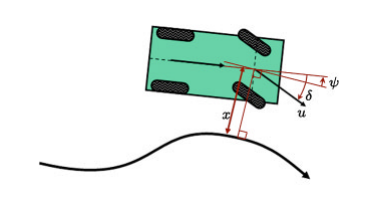

​	基本的转向角度控制律如下：
$$
\delta(t)=\psi(t)+arctan{kx(t)\over u(t)}
$$
其中 k 为增益参数。第二项为航迹误差 x(t) 调整转向比例，这个错误越大，就会有越大的转向响应。

​	使用具有无限的轮胎硬度和严格的转向限制的线性自行模型，对控制律的影响如下：
$$
x(t)=-u(t)sin\ arctan({kx(t)\over{u(t)}})={-kx(t)\over {\sqrt{1+({kx(t)\over{u(t)}})^2}}}
$$
因此对于小的轨迹误差，
$$
x(t) \approx x(0)exp-kt
$$
因此，错误指数收敛于 x(t) = 0。参数 k 决定了收敛速度。随着航迹错误增大，arctan 函数的作用是将前轮转向直接指向航道，产生只受限于车速的收敛。对于任何 x(t)，微分方程都会单向收敛于零。下图展示了 Stanley 在模拟器中最后控制器的相位图。航迹错误 x(t) 和转向角 psi(t)，包含转向输入饱和的影响。这些图说明，在两个不同速度的例子中，控制器很好地对全范围的姿态和大范围的轨迹误差进行收敛。

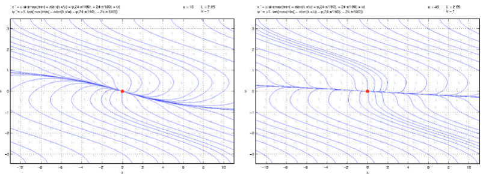

​	这种基本的方法对低速行驶很有效，它的一种变体甚至可以用于反向驾驶。然而，它忽略了几个重要的影响。在控制回路中存在离散的时延，在转向柱中存在惯性，并且随着速度的增加需要消耗更多的能量。这些影响是通过在转向命令和转向角度之间的差异进行简单的衰减，该术语称为偏航阻尼。最后，为了补偿实际气压轮胎的滑移，车辆被要求具有一种稳定的偏航偏移，该偏航偏移是基于会有滑移现象的车辆模型的路径曲率和车辆速度的非线性函数，该函数在测试中进行过矫正和验证。当在实体车辆上运行时，这些要求结合起来可以稳定车辆并使轨迹误差降到零。由此产生的控制器已经在测试中被证明是稳定的，测试范围包括路面、深的越野泥坑，以及有足够紧密曲率半径导致实际滑移的轨迹。它典型地演示了与系统估计误差相当的跟踪误差。

## 开发进程和比赛结果

### 比赛准备

​	曾在三个不同的地方为比赛准备。斯坦福大学，在巴斯托和普利姆之间的 2004 年超级挑战赛的赛道以及凤凰城附近的索诺兰沙漠。在比赛前几周，团队搬到了亚利桑那州，享受美国亚利桑那州通用大众试验场的热情。下图是车辆在极端越野地形下的硬件测试，这些照片是在认为操纵车辆的时候拍摄的。

​	在开发 Stanley 的过程中，斯坦福赛车队坚持严格的开发和测试计划表，期间有明确的里程碑。比赛的重点放在了早期的集成上，因此在比赛前一年就有了端到端的原型。系统定期在沙漠环境中进行测试以代表团队对超级挑战赛的期望。在比赛前的几个月里，所有的软件和硬件模块调试好，然后被冻结。这个系统的开发在比赛之前就终止了。

​	系统性能的主要度量是致命性故障之间的平均距离 MDBCF（mean distance between catastrophic failures）。致命性故障被定义为驾驶员必须介入的一种情况。常见的故障包含软件问题，比如姿态评估错误导致地形分类失败的问题。偶尔的故障是由硬件造成的，例如，车辆的动力系统。2004 年 12 月，MDBCF 大约为 1 英里。在 2005 年 7 月，它增加到 20 英里。全国资格赛前的最后 418 英里没有失败；这包括一次 200 英里的循环测试。当时，系统开发被暂停，Stanley 的横向导航精度约为 30 厘米。该车已经自动行驶了 1200 多英里。

​	在为这次比赛做准备时，团队还测试了在最后一场比赛中没有使用的传感器。其中一款是工业级的立体视觉传感器，其基线为 33 厘米。在早期的实验中，我们发现立体视觉系统在近距离内提供了很好的结果，但在精度上落后于激光系统。不使用立体视觉系统的决定仅是基于这样的观察结果，即立体视觉对激光系统的加持很小。一个更大的基线可能会使立体视觉系统在更大的范围内更有用，但遗憾的是，这是不可用的。

​	第二个没有在比赛中使用的传感器是 24 GHz 的雷达系统。雷达使用线性频移键控调制（LFMSK）传输波形；它通常用于自适应巡航控制。经过对传感器增益和置信阈值的仔细调整，该雷达对沙漠地形中废弃车辆等大型正面障碍物的检测效果非常好。与第 6 节中的单视觉系统类似，该雷达的任务是在激光传感器之外的范围内对道路进行筛查。如果探测到潜在的障碍物，系统将 Stanley 的速度限制在 25 英里每小时，这样激光就可以及时探测到障碍物以避免碰撞。

​	虽然雷达系统在测试中被证明非常有效，但有两个原因阻止了它在比赛中的使用。第一个原因是技术上的：在 NQE 期间，接收计算机的 USB 驱动程序反复出现问题，有时会导致接收计算机卡死。第二个原因是基于实用角度分析的，在 NQE 期间，很明显，在高速区域遇到大的正面障碍的概率很小；即使它们存在，视觉系统也很有可能探测到它们。因此，车队认为雷达系统带来的技术风险超过了它带来的好处，因此决定在比赛中不使用雷达。

### 国家资格赛

​	国家资格赛 NQE（National Qualification Event）于 9 月 27 日至 10 月 5 日在加州丰塔纳的加州高速公路上举行。像大多数竞争车辆一样，Stanley 经过四轮试跑后获得了参赛资格。在 43 名半决赛队伍中，有 11 队在第一轮跑完全程，13 队在第二轮跑完全程，18 队在第三轮跑完全程，还有 21 队在第四轮跑完全程。Stanley 的时间是有竞争力的，但不是最快的，第一轮 10：38，第二轮 9：12，第三轮 11：06，第四轮 11：06。但是，Stanley 是唯一一辆每次都能通过 50 道大关，并避免与所有障碍物相撞的车辆。这完美的表现为 Stanley 赢得了的第二顺位，位于 CMU 的 H1ghlander 之后，Sandstorm 之前。​ 	

### 比赛

​	2005 年 10 月 8 日凌晨 4 点 10 分左右，斯坦福赛车队收到了比赛数据，包括 2935 个 GPS 参考坐标，以及最高时速 50 英里的速度限制。Stanley 于 2005 年 10 月 8 日上午 6 时 35 分开始比赛。车辆立即加速，以限速或略低于限速行驶。比赛进行到 3 小时 45 分 22 秒时，在 73.5 英里处，DARPA 第一次让 Stanley 停下来，给比 Stanley 早 5 分钟出发的 CMU 的 H1ghlander 更多的空间超车。第一次暂停持续了 2 分 45 秒。仅 5 分钟 40 秒后，Stanley 又被暂停了下来，在进入比赛 3 小时 53 分钟 47 秒，行驶了 74.9 英里处。本次暂停时间为 6 分 35 秒，总暂停时间为 9 分 20 秒。暂停的位置如下图中红圈标记的位置。从那时起，Stanley 不断接近 H1ghlander，距离只有几百码。尽管 Stanley 紧追其后于 H1ghlander，但它在这场竞赛中处于领先地位。

. At the locations marked by the red x, the race organizers paused Stanley because of the close proximity of CMU's H1ghlander robot. At Mile 101.5, H1ghlander was paused and Stanley passed. This location is marked by a green x.")

​	进入比赛 5 小时 24 分 45 秒时，DARPA 最终暂停了 H1ghlander 并让 Stanley 超车。超车点发生在 101.5 英里处；位置如上图中标记为绿圈的位置。下图为 Stanley 经过该位置获取的经过处理的相机图像，另外一张为 H1ghlander 被超过的时候的 3D 激光建模。由于 Stanley 以第二顺位出发并以第一名的成绩完成比赛，所以在比赛只遇到了头号种子 H1ghlander。

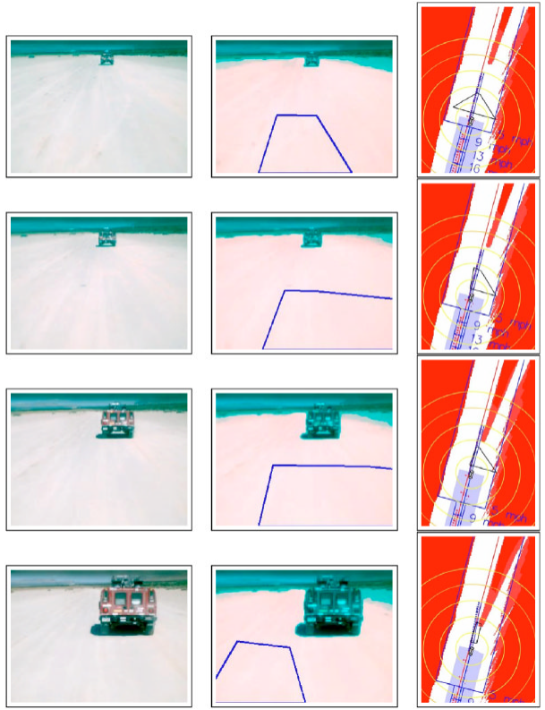

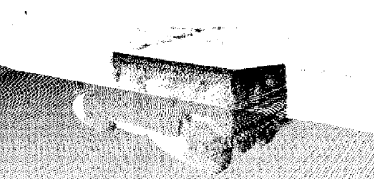

​	如本文简介中所述，Stanley 在 6 小时 53 分钟 58 秒的时间内第一个完成比赛。它的总平均速度是 19.1 英里每小时。然而，在比赛中，斯坦利的速度变化很大。最初，地形是平坦的，车速限制允许更高的速度。Stanley 在比赛开始 13 分钟 47 秒时达到了每小时 38.0 英里的最高速度。在比赛 16 分钟 56 秒后，7.00 英里处，Stanley 的最大平均速度为 24.8 英里每小时。车速限制迫使 Stanley 减速。在 84.9 英里到 88.1 英里之间，DARPA 将最高速度限制在每小时 10 英里。此后不久，在 90.6 英里处，4 小时 57 分 7 秒的比赛中，Stanley 达到了它的最低平均速度 18.3 英里每小时。速度的总体曲线如下图。

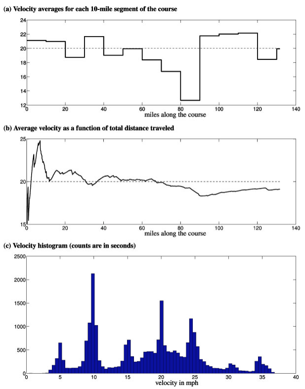

​	正如文中所述，Stanley 使用很多的策略来确定实际的行驶速度。在 68.2% 的赛程中，它的限速正如被预先计算好的一样，通过遵循 DARPA 的速度限制或在转弯时的最大横向加速限制。对于剩余的 31.8%，Stanley 基于传感器的测量结果选择动态减速。其中有 18.1% 的减速是因为陡峭和崎岖的地形造成的。在总距离的 13.1% 中，视觉模块迫使 Stanley 减速到 25 英里/小时。然而，如果没有视觉模块，Stanley 的最高速度将被迫只能达到 25 英里/小时，这将导致完成时间达到大约 7 小时 5 分钟，可能会落后于 CMU 的 Sandstorm 。最后，在 0.6% 的赛程中，Stanley 行驶速度变慢是因为没有 GPS 数据。下图显示了地形崎岖对整体速度的影响。顶部的曲线说明了 Stanley 为了适应崎岖的地形而放慢速度的幅度；底部的曲线显示了由 DARPA 提供的山体的海拔剖面。崎岖地形主要在山区。我们坚信，使速度适应崎岖地形的能力是 Stanley 成功的关键因素。

​	在这个过程中，Stanley 也遇到了一些意想不到的困难。在比赛的初期，Stanley 的激光数据流多次延迟在 300 到 1100 毫秒之间。总共发生了 17 起意外，几乎都发生在 22 英里到 35 英里之间。激光数据中不精确的时间戳导致在测绘地图中插入了虚假的障碍物。其中的四个例子，这些意外导致了 Stanley 有较大角度的转向。最显著的两个转向如下图所示。这两个急转向都很明显。在其中一个例子中，Stanley 甚至短暂的开到了护坡道上，如下图 a 所示；另一个例子是，Stanley 在没有任何障碍的开阔的路面上突然转向，如下图 b 所示。车辆在任何时候都没有危险，因为它穿越的护坡道是可以驾驶的。然而，由于这些错误，Stanley 在 22 英里到 35 英里之间减慢速度很多次。因此，这些意外的主要影响是在比赛的早期消耗了些时间。数据流延迟问题在 37.85 英里后完全消失了。仅在 120.66 英里时再次发生一次，但驾驶行为没有任何明显变化。

​	在 4.7% 的超级挑战赛中，GPS 报告了 60 厘米或更多的误差。当然，这个数字只是该单位自己的估计，不一定是准确的。然而，这提出了一个问题，即在线地图和路径规划在这场竞赛中有多重要。

​	Stanley 频繁地离开 RDDF 数据确定的中心轴。平均横向偏移量是 ±74 cm。在比赛中的最大横向偏移量达到了 10.7m，这是上图中转向导致的结果。然而，这样的事件是罕见的，并且在几乎所有的情况下，非零侧向偏移是由于障碍物在自动驾驶车辆的路径上造成的。

 ​	下图展示的是从啤酒瓶路段获取的原始激光数据，该路段是赛程中最困难的路段。第二张图则是这段路的图像以及绘制图。在这里 DARPA 提供的道路用两条实心蓝线标出。这张图片显示 Stanley 左边的护堤一直沿着道路延伸。Stanley 在道路限制的范围内尽量往左行驶。最后一张图则显示了 Stanley 在啤酒瓶路段的横向偏移柱状体。在这段路程中，Stanley 平均在 RDDF 的中轴向右偏移了 66 厘米。我们猜想如果向左偏移 66 厘米行驶会导致多处致命伤。这说明了 Stanley 在驾驶时对环境做出反应的能力的重要性。简单地跟随 GPS 点可能会妨碍Stanley 完成比赛。

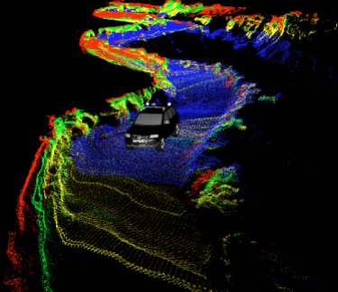

## 讨论

​	这篇论文对赢得 DARPA 超级挑战赛的自动驾驶车辆进行全面的调研。Stanley 是由斯坦福赛车队和它的主要支持者联合开发的，它依靠一个软件流程来处理传感器数据，并确定合适的转向、油门、刹车和换挡命令。

​	从更广泛的角度来看，Stanley 的软件反映了自动驾驶车辆控制的通用方法论。然而，许多单独的模块依赖于最先进的人工智能技术。机器学习的广泛应用，无论是在之前还是在比赛中，都使 Stanley 变得更加健壮和精确。我们相信，这些技术和广泛的测试，为 Stanley 在这场比赛的成功作出了重大的贡献。

​	尽管 DARPA 超级挑战赛是自动驾驶汽车探索过程中的一个里程碑，但它也留下了许多重要问题。其中最重要的是比赛环境是静态的这个事实。Stanley 在交通中无法导航。自动驾驶汽车要想成功，像 Stanley 这样的车辆必须能够感知移动中的车辆并与之交互。尽管许多系统已经显示了令人印象深刻的结果（Dickmanns et al.,1994; Hebert, Thorpe & Stentz, 1997; Pomerleau & Jochem, 1996），但还是需要进一步的研究来达到这项要求很高的任务所需的可靠性水平。即使在静态环境下驾驶，Stanley 的软件也只能处理有限类型的障碍。例如，目前的软件无法区分高草和岩石，这是近年来非常流行的研究主题（Dima & Hebert, 2005; Happold, Ollis &Johnson, 2006; Wellington, Courville & Stentz, 2005）。

## 致谢

​	斯坦福车队 SRT（Standford Racing Team）是由四个主要的支持单位赞助的：美国大众的电子研究实验室，莫尔达维多风险投资公司，Android 和红牛。主要支持单位与斯坦福大学的团队领导组成了 SRT 指导委员会，负责监督 SRT 的运作。SRT 还得到了英特尔研究公司、霍尼韦尔公司、Tyzx 公司和 Coverity 公司的支持。并且David Cheriton 提供了慷慨的财政资助。斯坦福大学，大众汽车和相关机构的很多人帮助我们开发了 Stanley，非常感谢。SRT 也感谢 DARPA 组织这个伟大的比赛和许多记者提供了新闻报道。最后，我们要感谢为这次活动做准备和参与的许多朋友，以及一路上帮助我们和其他团队的许多人。

## 链接

[DARPA Grand Challenge 美国无人驾驶挑战赛 全程记录](https://www.bilibili.com/video/av200073789/)

[Sebastian Thrun](https://www.jianshu.com/p/a47a9e7587f1)    [Dude, where's my driverless car?](https://www.ted.com/playlists/dude_where_s_my_driverless_ca)

[Stanley: The robot that won the DARPA Grand Challenge](http://www.riveryoung.cn/2020/08/30/DARPA-2005-Stanley/DARPA-2005-Stanley.pdf)

[无人驾驶汽车是如何看清路况的](http://open.163.com/newview/movie/free?pid=MBBL91A3O&mid=MBBL9CG33)

